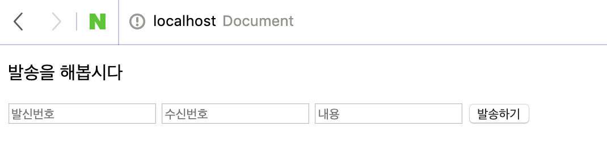

# 솔라피 OAuth2 연동 Node & Express를 이용하여 앱 만들기

### 앱 소개

간단한 웹 문자 발송 어플리케이션을 만들어보도록 하겠습니다.

로그인은 [솔라피](https://solapi.com/)의 OAuth2를, 개발 언어는 NodeJS를 사용하였습니다.

### OAuth 2란

다양한 서비스들에서 네이버 로그인, 구글 로그인, 페이스북 로그인, 카카오 로그인 등등 SNS나 다른 서비스를 이용한 소셜 로그인을 하는 것을 보셨을겁니다.


이러한 소셜 로그인을 지원하는 이유는 서비스 운영면에서 보았을 때 계정 관리를 신뢰할 수 있는 외부 서비스에 맡길 수 있다는 점에서 관리가 줄어들고 보안적으로도 더 안전해집니다.

제가 사용하려는 솔라피 또한 이러한 OAuth 2 서비스를 제공하고 있습니다.

**OAuth 2의 내부 흐름은** [**솔라피 문서**](https://docs.solapi.com/authentication/oauth2)**에서도 확인할 수 있습니다.**

### 서버 구현하기

먼저 [Node](https://nodejs.org/ko/)로 OAuth 2 및 문자 전송 등 앱의 전반적인 기능을 담당할 서버를 구현합니다.

작업 폴더를 하나 만들고 [npm](https://www.npmjs.com) 셋팅을 합니다.

```bash
$ npm init
```

서버로는 Node의 대표 서버 모듈인 [express](https://expressjs.com/ko/)를 사용합니다.

```bash
$ npm i --save express
```

index.js 파일을 만들고 간단하게 서버를 구현해봅니다.

서버의 port는 8080으로 하였습니다.



이제 서버를 직접 실행해봐야 합니다.

코드가 수정될 때마다 서버를 재시작 해야하는 귀찮은 점을 방지하고자 [nodemon](https://nodemon.io)도 사용해줍니다.

```bash
$ sudo npm i -g nodemon
```

npm init을 통해 생성된 package.json에서 npm start 명령을 설정하고



```javascript
"scripts": {
  "start": "nodemon index.js"
}
```



터미널에서 실행해봅니다.

```bash
$ npm run start
```

성공적으로 실행이 되었다면 console에 다음과 같이 출력됩니다.


### OAuth 2 로그인 버튼 제작하기


[앱 등록](https://www.notion.so/ec71ebba081f400e85bd7aae7dea4983#dc2bcabfab514a9aa90b8b91ef1841fd)을 먼저 완료해야 합니다.


웹 페이지를 띄워주기 위해 [EJS](https://ejs.co) 템플릿 엔진을 사용하였습니다. 템플릿 엔진은 [hogan](https://twitter.github.io/hogan.js/), [pug](https://pugjs.org/api/getting-started.html) 등 아무거나 사용해도 무관합니다.

EJS를 설치합니다.

```bash
$ npm i --save ejs
```

먼저 views/index.ejs 파일을 하나 만들고



index.js에서 view engine을 설정하고 라우팅을 잡아줍니다.



저장 후 성공적으로 반영 되었다면 [http://localhost:8080](http://localhost:8080) 로 접속 시 다음과 같은 페이지가 출력됩니다.


현재 상태에서 버튼을 누르면 아직 form action에 해당되는 /login 라우트를 잡아주지 않았기 때문에 오류가 발생할 것 입니다.

이제 /login 라우트를 잡아줍니다.

/login에서는 accessToken을 발급 받기 위한 authorizationCode를 발급 받기 위해 [아래 파라미터](https://docs.coolsms.co.kr/authentication/oauth2#step-1)들을 [https://api.solapi.com/oauth2/v1/authorize](https://rest.coolsms.co.kr/oauth2/v1/authorize) 로 넘겨줘야 합니다.

이때 넘겨주는 파라미터 값은 앱 생성 시 발급받은 값들로 넣어주시면 됩니다.

저희의 경우 메시지 발송만 할 것이기 때문에 scope는 message:write 만 사용할 것 입니다.

더 많은 기능을 사용하기 위해서는 [다른 권한 목록 링크](https://docs.solapi.com/authentication/oauth2-scope)를 참고하여 추가로 입력해 주시기 바랍니다.




저장 후 다시 솔라피 로그인 버튼을 누르면 이렇게 로그인 페이지가 나옵니다.  
만약 이미 로그인이 되어 있다면 로그인은 생략됩니다.


로그인에 성공하면 다음과 같이 권한 요청 페이지가 나옵니다.

이 페이지에서는 해당 앱이 사용자들에게 어떤 권한들을 요청하는지 볼 수 있으며 승인을 하게 되면 앱 개발자가 해당 사용자의 허용된 권한에 한해서 정보를 사용할 수 있습니다.

아까 말한 것처럼 메시지 발송만 하는 앱 이기에 scope는 message:write 만 사용할 것 입니다.


승인을 하면 설정한 redirectUri로 code가 발급됩니다.

하지만 마찬가지로 아직 라우트를 잡아주지 않았기 때문에 아래와 같은 에러가 발생합니다.


/authorize 에서는 넘겨받은 authorizationCode로 accessToken을 발급 받는 작업을 합니다.  
[관련 문서 바로가기](https://docs.solapi.com/authentication/oauth2#step-2)



먼저 API Request를 하기 위해 [request](https://github.com/request/request)와 [request-promise](https://github.com/request/request-promise)를 설치합니다

```text
$ npm i --save request request-promise
```

accessToken을 발급 받기 위해 아래와 같은 파라미터를 이용해 HTTP Request를 보냅니다.

grant\_tyep의 경우 authorizationCode를 사용하기 때문에 값을 authorization\_code로 고정시켜 둡니다.

code의 경우는 redirect 될 시에 query 값으로 넘어오기 때문에 req.query로 받아줍니다.

마찬가지로 client\_id, client\_secret, redirect\_uri는 앱 생성 시 발급받은 값들로 넣어주시면 됩니다.




result를 console.log 로 값을 확인해봅니다.

성공 시 result 값은 다음과 같습니다.



이제 이 access\_token을 저장하여\(쿠키나 SessionStorage 등\) 후에 솔라피 API들에 요청을 보낼 때에 토큰을 헤더에 실어서 보내면 정상적으로 API 인증처리가 완료됩니다.

이 예제에서는 [express cookie](https://github.com/expressjs/cookie-parser)를 사용하도록 하겠습니다.

```text
npm i --save cookie-parser
```

설치 후에 사용은 다음과 같이 합니다.



이제 받아온 access\_token을 쿠키에 저장합시다.

쿠키 이름은 APP\_COOKIE로 하였으나 원하는 이름으로 지정할 수 있습니다.



이제 토큰을 받았으니 토큰을 이용해서 발송을 하는 페이지로 이동해 줍니다.



send 라우트에서는 문자 발송 기능을 담당합니다.







express의 post 요청에서 body 값을 가져오려면 [bodyParser](https://github.com/expressjs/body-parser) 미들웨어를 설치하고 적용해야 합니다.

```text
$ npm i --save body-parser
```



post의 /send에서는 문자를 발송하는 요청을 할 것입니다.

from, to, text는 form에서 보내주어 req.boby에서 가져오고,

header에 토큰 정보가 들어가야 하기 때문에 req.cookies에서 토큰 정보인 APP\_COOKIE를 가져옵니다.




특히 요청을 보낼때에 body 부분에 앱 아이디를 필수로 입력하셔야 메시지 발송 시 수익이 발생하게 됩니다.


```text
agent: {
  appId: 'vTL0qHdlXXXp'
}
```

이제 [http://localhost:8080/](http://localhost:8080/send) 로 가서 순서대로 로그인부터 발송까지 진행해 보시면 아래와 같은 결과값을 보실 수 있습니다.


솔라피 [문자 발송 내역](https://solapi.com/message-log)에서도 확인이 가능합니다.

특히 앱 아이디를 넣은 경우는 발송 내역에도 앱 아이디가 나오므로 정상적으로 들어갔는지 확인하시면 됩니다.


이렇게 솔라피 OAuth2 연동 Node & Express를 이용하여 앱 만들기가 완료되었습니다.

지금부터 발송 건마다 쌓여가는 수익금을 확인해보세요.

#### 또한 실제로 [적용한 사례](https://sendsms.kr)를 체험해보세요.

### 수익 정산

발송에 성공하면 [수익 내역](https://www.solapi.com/me/apps/settle) 페이지에서 아래와 같이 정산 받을 금액을 확인할 수 있습니다.

정산은 매달 10일 오전 11시에 이루어지며, 정산된 금액은 언제든지 계좌로 출금이 가능합니다.


### 수익금 출금

실제로 한달 뒤 10일에 메일로 정산 알림이 와서 솔라피 사이트의 [잔액 사용 내역](https://solapi.com/balance/history)으로 들어가보니 수익금이 들어온 것을 확인할 수 있었습니다.


정산된 수익금은 위에서 언급한대로 자유롭게 출금이 가능하기 때문에 [출금 요청 내역](https://solapi.com/withdrawal/history)으로 가서 제 계좌로 출금을 해보았습니다.

계좌 등록 후 출금할 금액을 입력하고 예상 출금 금액을 확인한 뒤 출금 요청 버튼을 누릅니다.


요청이 완료 되었으면 이렇게 대기중으로 표시됩니다.


몇일 후 메일을 확인해보니 이렇게 출금 처리 알림 메일이 도착하였습니다.


실제로 은행 어플에서 확인해보니 수수료를 제외한 금액이 입금 된 것을 확인할 수 있었습니다.


