# 솔라피 앱 스토어에 내가 만든 앱 등록하기

### 솔라피 앱 스토어 서비스란?

솔라피에서 제공하는 앱스토어 서비스에 앱을 등록 후 문자나 알림톡을 발송하면 발송 성공 건 마다  
**최대 50원의 수익**을 얻을 수 있는 솔라피만의 특별한 수익 플랫폼 입니다.

대표적으로 아래와 같은 비즈니스 모델들이 현재 운영중이며,  
문자 발송이 자주 이루어지는 서비스에 적합합니다.

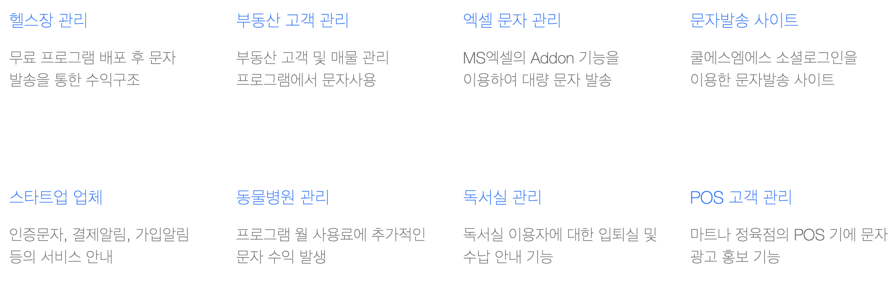

### 앱 등록하기


개발한 앱을 솔라피 앱 스토어에 등록하는 방법입니다.


[솔라피의 앱 스토어](https://solapi.com/apps)에 접속하여 하단에 **앱 등록하기** 버튼을 클릭합니다.

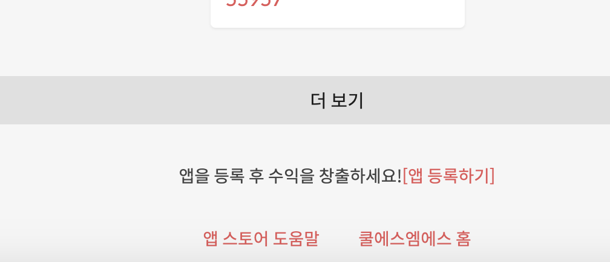

**앱 등록하기**를 클릭하여 이동한 페이지의 오른쪽 상단 **앱 생성** 버튼을 누릅니다.

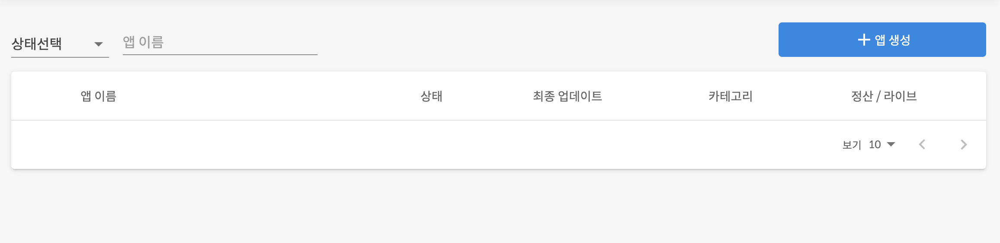

간단하게 앱 이름만 입력하면 앱이 생성됩니다.

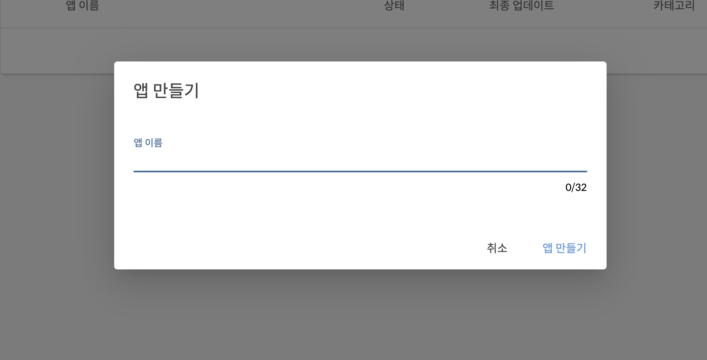

앱이 생성되면 해당 앱의 설정 페이지가 나오고 이때 수익 정산에 쓰일 앱 아이디와 OAuth 2에 사용할 수 있는Client ID, Client Secret이 발급됩니다.

Redirect URI란 OAuth 2 로그인 시에 token을 얻기 위해 code를 발급받아올 주소를 의미합니다. OAuth 2을 사용하지 않으시는 분들은 운영중이신 사이트 주소를 입력하시면 됩니다. \(없다면 [http://localhost:8080](http://localhost:8080)를 입력해주세요.\)

Scope는 해당 앱에서 필요한 권한들을 체크하시면 됩니다.

OAuth 2에 대한 자세한 설명은 [솔라피 OAuth 2 개발 문서](https://docs.solapi.com/authentication/oauth2)를 참고해주시기 바랍니다.

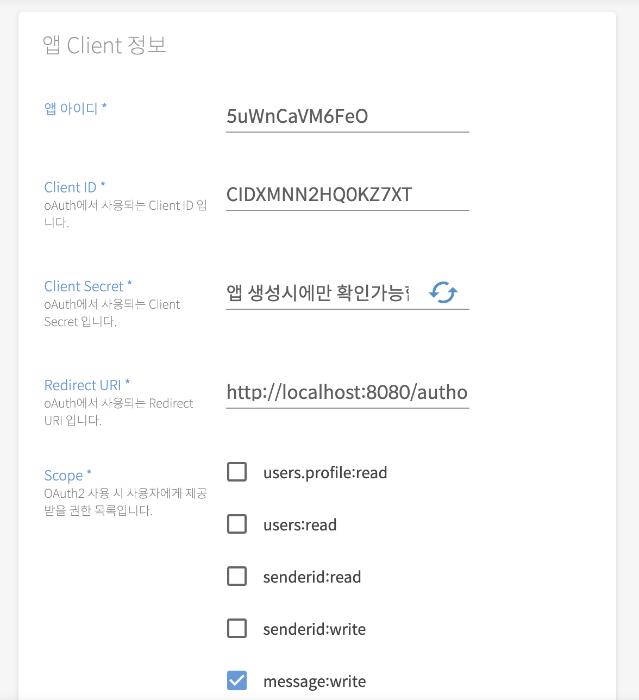


Client Secret의 경우 최초 한번만 공개되고 그 뒤에는 재발급을 통해서만 알 수 있으니 꼭 안전한 곳에 저장을 해놓으시기 바랍니다.


앱 수익정보에서는 **이 앱을 통해 문자를 발송할 시 앱 개발자가 얻을 수 있는 수익**을 책정할 수 있습니다.

문자 타입별로 각각 다르게 수익을 설정할 수 있으며, 최대 50원까지 설정이 가능합니다.

저의 앱은 주로 SMS를 발송하는 용도로 사용할 것 이기에 SMS 수익만 2원을 책정하겠습니다.

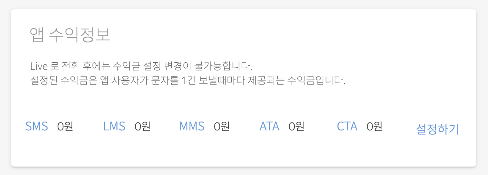

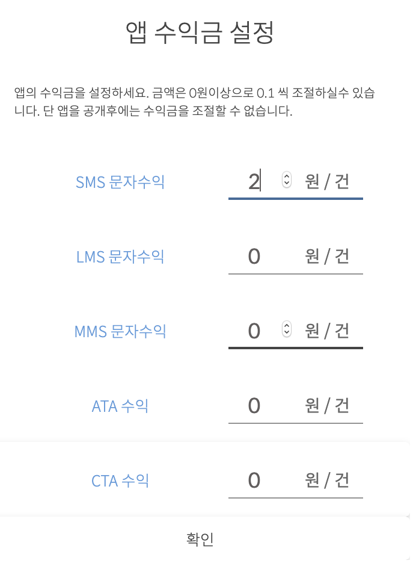

확인을 누르면 성공적으로 변경이 됩니다.

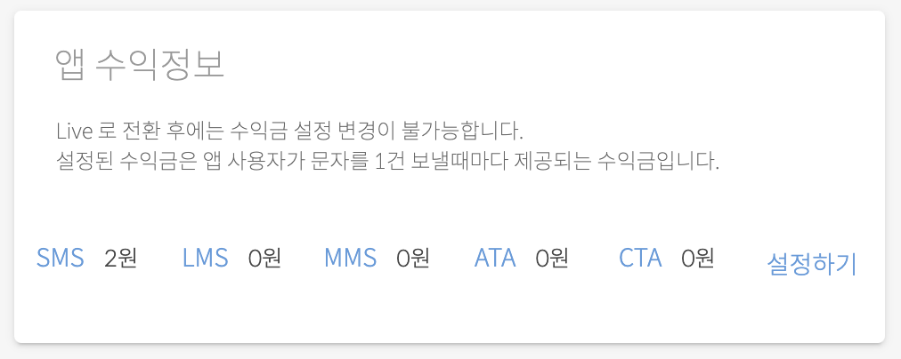

앱 기본정보에서는 앱 이름, 소개, 설명, 버전, 카테고리를 설정해주시면 됩니다.

앱 소개란에는 간단한 소개말을 적고, 앱 설명은 최대한 상세하게 적어 사용자들이 불편함이 없도록 해야합니다.

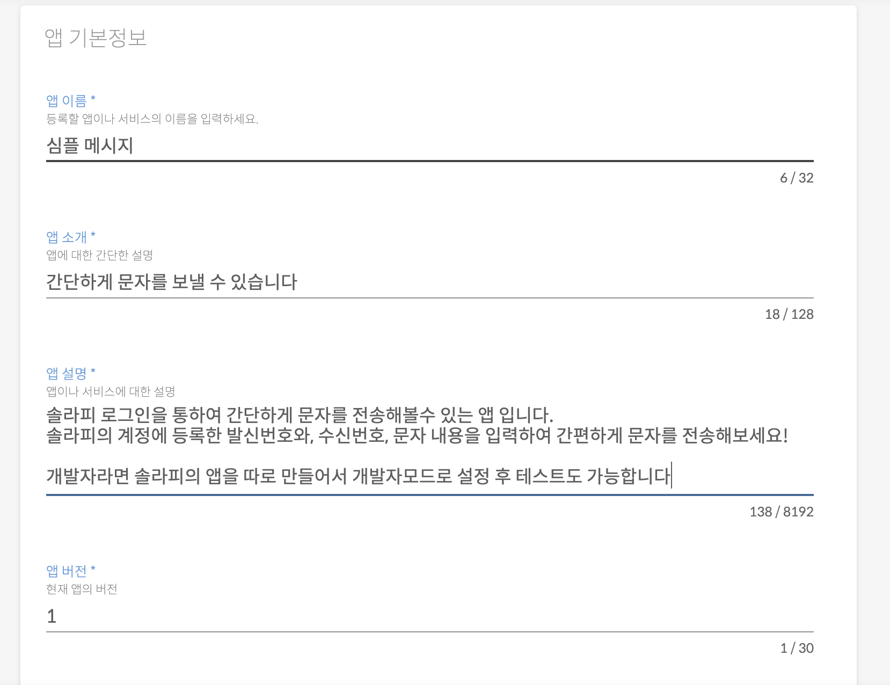

앱 스토어에 보여질 이미지를 설정합니다.

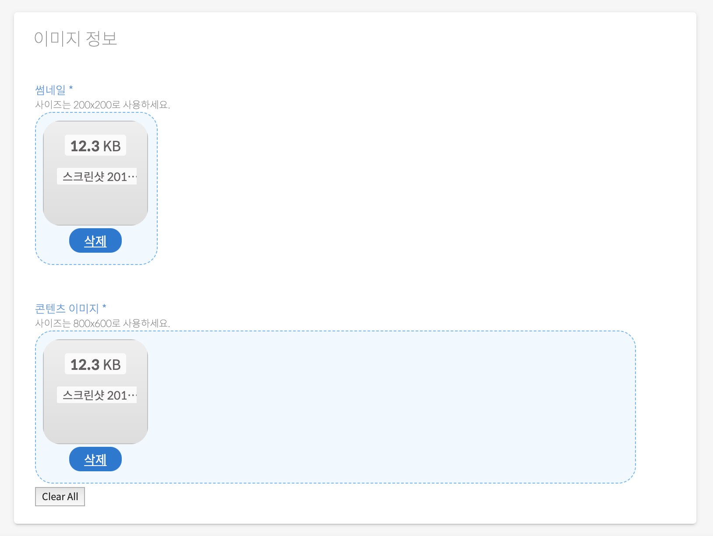

마지막으로 연락처 정보를 작성해주면 앱을 배포할 준비가 완료됩니다.

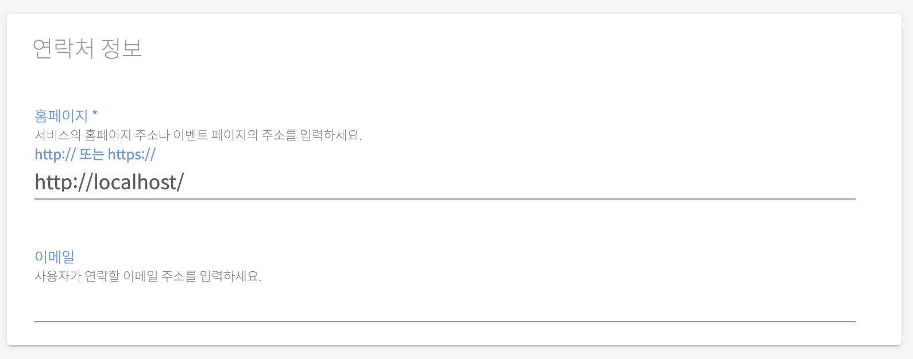

이때 맨 밑에 **앱 업데이트**를 꼭 누르셔야 저장이 됩니다.

LIVE 상태가 아닐 때에는 수익금 설정이 자유로우나 LIVE 전환 후에는 수익금 변경이 불가능하니 꼭 배포 준비가 완료 되었을 때 전환하는 것을 추천 드립니다.

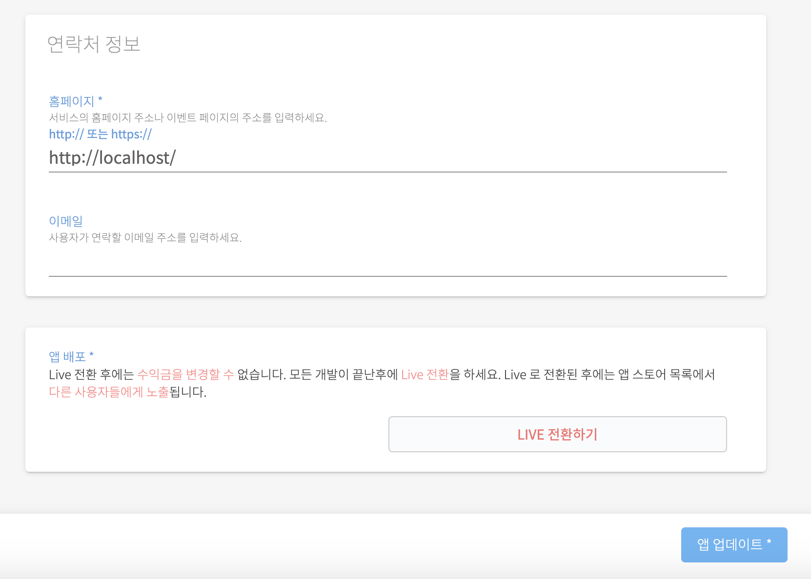

앱 업데이트가 성공적으로 되면 아래와 같은 메시지가 나오고 앱 등록 절차가 마무리됩니다.

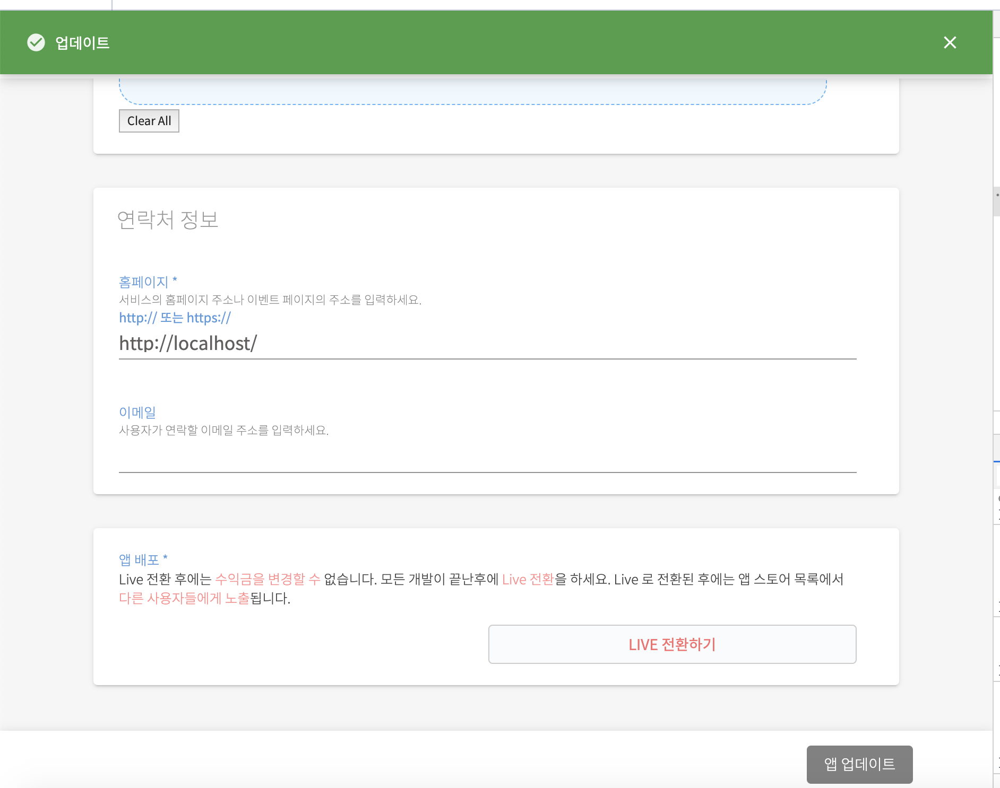

### 등록한 앱 연동하기

솔라피에서 제공하는 NodeJS [예제 코드](https://github.com/solapi/examples)를 통해 발송 시 어떻게 앱을 적용하는지 알아보겠습니다.

앱을 등록하고 등록한 앱과 연동하여 수익을 발생 시키려면 위에서 발급받은 앱 아이디를 입력해주세요.











### 실제로 [적용한 사례](https://sendsms.kr)를 체험해보세요!

