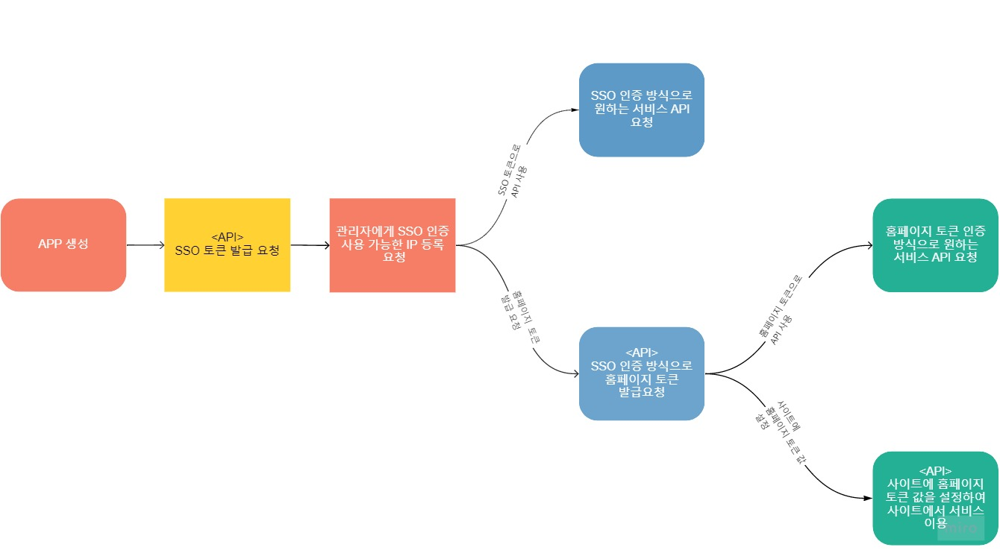

# SSO란?

싱글사인온\(Single Sign-On, SSO\)은 하나의 로그인 인증 수단을를 사용해 사이트에서 제공하는 여러 어플리케이션 혹은 API에 접근할 수 있는 중앙화된 세션 및 사용자 인증 서비스입니다.

솔라피에서도 SSO이용이 가능하며 기본 순서는 아래와 같습니다.

각각 SSO API 관련 설명은 아래 링크를 참고해주세요.

\*\*\*\*[**SSO API Reference**](https://docs.solapi.com/api-reference/api-sso)  
****  
SSO 토큰, 홈페이지 토큰 모두 개별적으로 API 이용이 가능하며, 토큰을 이용하여 API접근 방식은 아래 링크를 참고해주세요.  
  
[**SSO 토큰 인증 방식**](https://docs.solapi.com/authentication/authentication-sso)  
****[**홈페이지 토큰 인증 방식**](https://docs.solapi.com/authentication/oauth2-3/oauth2#step-3-api)  
  
기타 문의 사항은 [**1:1문의**](https://support.solapi.com/hc/ko/requests/new)로 남겨주시면 감사하겠습니다.

